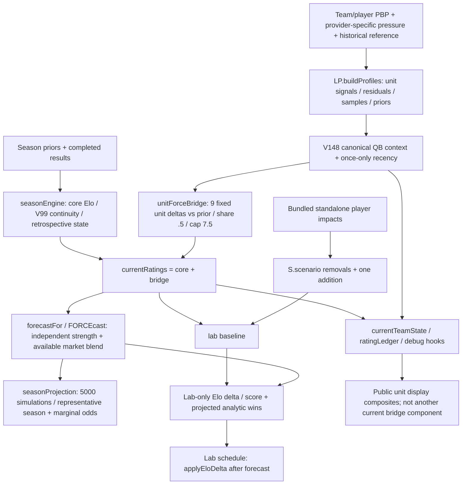

# Cycle 7 multi-MD synthesis

Single Codex research lane, 2026-10-04. Base: `cf391daa2d43a44fe9d742ea0b96cc537d1a7136`; branch `cycle7/codex-multi-md-investigation`. Claude adversarial review returned minor research corrections; the nine bounded corrections are applied here for targeted re-review, not production promotion. No owner/model/business decision, provider adoption, purchase, production change or implementation authorization is made here.

Read [MD-04](MD04_ROSTER_LAB_MARGINAL_VALUE_INVESTIGATION.md), [MD-05](MD05_UNIT_ATTRIBUTION_INVESTIGATION.md), [MD-06](MD06_LIVE_WIN_PROBABILITY_FEASIBILITY.md), then [reproduction and evidence limits](research/cycle7/README.md). Each recommendation includes support, counterevidence, uncertainty and a falsifier. Targeted re-review remains pending; no item is COMPLETE.

## Shared architecture / attribution map

`profileBeforeWeek()` / `canonicalGameTeamState()` reconstruct historical core and prior-week units, with no automatic QB-return correction. Manual internal QB scenario primitives remain disabled and publicly unreachable after accepted MD-03/UX-19; they are a separate chain and not a Roster Lab dependency. Research capability does not imply production activity.

Important shared routes: sacks enter QB EPA/ANYA and OL/rush disruption indicators; passing outcomes feed QB/receiver/coverage/scoring; rushing feeds RB/run defense/scoring, with meaningful QB runs also in the canonical QB union. Current coverage excludes sacks; current OL is pass protection only; receiver/RB receiving already have partial QB residuals. Display composite reuse is not another bridge charge. Team game outcomes underpin both core ratings and profile signals. A balanced numerical ledger is not proof of causally independent football attribution.

Unit construction does not numerically invert the parent FORCE rating. Core regime/prior-confidence signals can affect unit continuity indirectly; receiver/RB receiving residuals depend on the team QB environment, and opponent QB context depends on other matchups. Current league/environment calibration is also shared. These dependencies are distinct from copying team FORCE into each unit.

The lab changes one scenario channel; it does not write canonical current ratings, units, historical/V99 states or league seasonProjection. Therefore a local MD-04 accounting correction can proceed independently of the deeper MD-05 bridge/unit redesign, provided it never applies both an Elo player delta and the same unit movement. Long-range canonical projections and lab analytic forecasts retain distinct semantics.

## Evidence strength and next work

| Item | Answer now | Implementation readiness | Remaining owner/evidence gates |
| --- | --- | --- | --- |
| MD-04 | Eleven rendered cases include +119/+67 non-starting QB removals; three offered-row misresolutions span 93 team × option combinations. Removal/incumbent mutation isolates double subtraction | Decision-free accounting/identity implementation candidate only; no calibrated marginal model is ready | Acquisition versus forced replacement and removal/replacement benchmark are separate optional owner decisions; later depth/insurance/role/workload needs calibration |
| MD-05 | All four raw pairs share plays; .938/.975 is mostly part-whole arithmetic, withdrawn as evidence of severe overlap. No literal full-value double charge proven; no residual formula earns adoption | First next step is actual production bridge-materiality measurement; possible ablations/replay are RESEARCH TOOLING, not implementation | Offline bridge is zero in all 32 teams; archived pre-kickoff live/provider inputs do not exist here; attribution concepts and predictive gates open |
| MD-06 | Corrected pre-play state Brier .175012584; linear proxy .171549850; delta −.003462735, CI [−.018154962, +.012026070]. Calibration worsens; not canonical FORCE evidence | Feed feasibility may proceed later; no public pilot before licensing certainty; internal trial needs purchase/trial approval | Full state, latency/corrections, competing-service applicability and league rights; source, budget, scope/business model, canonical prior holdout, OT/tie/stale contracts |

**IMPLEMENTATION CANDIDATE (separate authorization): MD-04 decision-free accounting/identity correction.** Use stable (team,pos,name) row identity or ID across options/checks/lookups, disambiguating or abstaining on collisions. Apply removals before choosing an incumbent; exclude removed players and evaluate the one supported addition once. Protect no-scenario identity, canonical/unit ratings and forecasts outside the scenario, one Lab forecast propagation and Reset. Retain current signed impacts and forced-replacement semantics. No unresolved owner choice is required for this narrow tranche. Acquisition versus forced replacement (Cousins case) and signed-removal/replacement benchmark (Tua/Tyrod/Rush) are optional separate owner decisions; neither is chosen or a gate to this narrow correction. Depth/insurance/workload/role capacity and broader valuations are later calibrated work. Support: real-bundle identity failures and the isolated +64→+56 incumbent mutation; counterevidence: incomplete availability/roster calibration still limits product claims. Prototype round trips are safety illustrations, not football validation. **Owner decision (2026-10-05):** this decision-free tranche alone is AUTHORIZED and implemented on review branch `cycle7/claude-md04-accounting`; independent validation and owner acceptance are pending. The optional policy decisions, later calibrated work, MD-05 implementation and any MD-06 feed, purchase or pilot remain NOT AUTHORIZED.

**RESEARCH TOOLING (separate authorization): MD-05 production bridge-materiality measurement first.** Capture a published/current production snapshot through ratingLedger/debug: team, each unit key and total bridge magnitude with model/time/input provenance. Offline current Elo equals core Elo for every team and cannot measure production contributions. Only then consider an ablation design/shared-passing or prospective causal archival tooling. The .938/.975 correlations are withdrawn as primary support: all original pairs overlap/shared plays; disjoint receiver/non-WRTE r=.076362 and part-whole shuffle mean r=.904987 show why. Other clean probes are .190346 QB/protection, −.126894 RB/not-stuffed and .190346 coverage/disruption. These descriptive subsets do not prove duplicate charging or causal skill. Existing residual/context treatment and legitimate interaction remain counterevidence. Full historical causal replay is unavailable without archived pre-kickoff live profiles/provider inputs. No production formula has earned adoption; no second production-model tranche is ready.

**FEASIBILITY FOLLOW-UP (separate authorization): MD-06 internal feed measurement/quotes and prospective pregame FORCE-prior archival.** BDL batched games/status plus per-game cursor tails with periodic correction rereads yield ~8.8k featured, ~93k expected all-game and a deliberately excessive ~2.26M stress envelope, all below GOAT 600/min. Sixteen concurrent games is theoretical/unreachable. A fixed $39.99 tier does not resolve missing timeouts/possession/corrections or rights. ALL-STAR $9.99/60 per minute has no plays. Competing-service applicability is UNKNOWN; league rights REQUIRES LEGAL REVIEW. SportsDataIO attribution is standard, agreement-specific; quote prices remain unknown. Feed feasibility is independent of MD-05. No public pilot before licensing certainty; internal purchase/trial still needs approval. Start archiving pre-kickoff canonical FORCE priors only under a separate follow-up authorization; a prior comparison need not await impossible complete historical profile replay. Featured/primetime/all and paid/public/mixed remain unselected owner options.

## Adversarial self-review

- MD-04: optional zero replacement changes negative-removal meaning; −20 fallback changes Tua removal to −12. Capacity/usage shares are synthetic; 60 checks are mostly construction/invariant checks, not football validity. Math.max clamps both states to a chosen replacement benchmark. The mixed WR/TE/RB-alias bucket can make Waller displace Michael Wilson rather than McBride. Better-versus-worse additions differ from mandatory trades. Current UI cannot perform multi-add round trips; those results are explicitly prototype-only. Backup insurance can be positive under a different owner contract. Do not call the prototypes validated player values.
- MD-05: residualizing an outcome cannot identify blocker, thrower or coverage responsibility from coarse PBP. Keeping residual+shared preserves information; dropping shared terms erases real interaction. Reduced correlation is not predictive improvement. All three mandatory probes reduce stability, and linear reparameterization creates almost no information gain. No full-stack Brier result is invented.
- MD-06: published commercial permission is recorded accurately rather than assuming inaccessible or fully cleared rights. Cheap does not mean complete/timely. Paginated tails miss old corrections; cost stress deliberately uses an unreachable 16-game ceiling and overcounts status calls; normal status is batched and play tails retain cursors, with periodic full rereads. Provider TTL is not a license or end-to-end SLA. The generic Elo proxy is clearly separated from canonical FORCE, has worse calibration, and excludes tied finals/OT/playoffs. The requested exact FORCE comparison remains an evidence gap.
- Chronology: current repository snapshot is not a fetched production season, and published historical archives are not original live-arrival replay. Legacy preseason grades and incompatible V137 cache are not mislabeled canonical V149 current metrics.

Parked: all-unit redesign, unsupported-position roster values, injury-insurance forecast, new player calibration, automatic QB-return replacement, OT probability, live provider adoption, paid/public business choices, broad UX cleanup and any default-test burden from long research jobs.

## Validation / handoff

Research outputs are pinned and rerun deterministically; prototype controls retain canonical state and shared interaction. Normal model/release/safe validation and catalog results are recorded in [research validation](research/cycle7/results/validation.json). The initial archive inherited CRLF conversion; authoritative safe validation uses explicitly LF-normalized scratch, preserving original repository bytes. No existing assertion is weakened.

Only the four investigation docs, research-only scripts/derived fixtures/results and MD-04/05/06 evidence/status/history in FORCE_ROADMAP.md are changed. All 47 authoritative IDs, phase order, PRESERVE rules, security authorizations and stop doctrine remain intact. Investigation REVIEW / implementation PLANNED and unauthorized; Claude required corrections are applied; targeted re-review is pending. Main and origin/main remain at the exact shared base. No merge, push or deployment.
