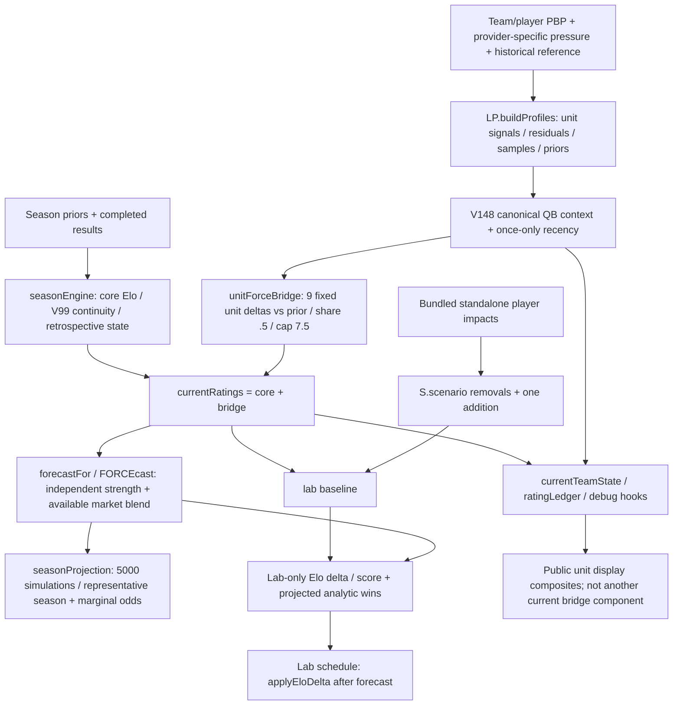

# Cycle 7 multi-MD synthesis

Single Codex research lane, 2026-10-04. Base: `cf391daa2d43a44fe9d742ea0b96cc537d1a7136`; branch `cycle7/codex-multi-md-investigation`. Investigation evidence is ready for adversarial independent review, not production promotion. No owner/model/business decision, provider adoption, purchase, production change or implementation authorization is made here.

Read [MD-04](MD04_ROSTER_LAB_MARGINAL_VALUE_INVESTIGATION.md), [MD-05](MD05_UNIT_ATTRIBUTION_INVESTIGATION.md), [MD-06](MD06_LIVE_WIN_PROBABILITY_FEASIBILITY.md), then [reproduction and evidence limits](research/cycle7/README.md). Each recommendation includes support, counterevidence, uncertainty and a falsifier. Independent review remains pending; no item is COMPLETE.

## Shared architecture / attribution map

`profileBeforeWeek()` / `canonicalGameTeamState()` reconstruct historical core and prior-week units, with no automatic QB-return correction. Manual internal QB scenario primitives remain disabled and publicly unreachable after accepted MD-03/UX-19; they are a separate chain and not a Roster Lab dependency. Research capability does not imply production activity.

Important shared routes: sacks enter QB EPA/ANYA and OL/rush disruption indicators; passing outcomes feed QB/receiver/coverage/scoring; rushing feeds RB/run defense/scoring, with meaningful QB runs also in the canonical QB union. Current coverage excludes sacks; current OL is pass protection only; receiver/RB receiving already have partial QB residuals. Display composite reuse is not another bridge charge. Team game outcomes underpin both core ratings and profile signals. A balanced numerical ledger is not proof of causally independent football attribution.

Unit construction does not numerically invert the parent FORCE rating. Core regime/prior-confidence signals can affect unit continuity indirectly; receiver/RB receiving residuals depend on the team QB environment, and opponent QB context depends on other matchups. Current league/environment calibration is also shared. These dependencies are distinct from copying team FORCE into each unit.

The lab changes one scenario channel; it does not write canonical current ratings, units, historical/V99 states or league seasonProjection. Therefore a local MD-04 accounting correction can proceed independently of the deeper MD-05 bridge/unit redesign, provided it never applies both an Elo player delta and the same unit movement. Long-range canonical projections and lab analytic forecasts retain distinct semantics.

## Evidence strength and next work

| Item | Answer now | Implementation readiness | Remaining owner/evidence gates |
| --- | --- | --- | --- |
| MD-04 | Exact rendered arithmetic reproduces signed-removal gains, forced worse-QB replacement and double incumbent subtraction, plus ambiguous name-only player selection. Two reversible role/share prototypes avoid those specific accounting failures under explicit synthetic assumptions | Local accounting tranche is plausible without MD-05; no calibrated all-position marginal model is ready | Acquisition vs forced replacement; explicit replacement/depth/insurance/usage contract; incomplete player roster and heuristic impacts |
| MD-05 | Strongest observed raw overlap is shared passing. Active bridge makes correlation relevant; current partial residuals already address part of it. Three mandatory attribution probes plus receiver probe reduce correlation but impair stability or fail meaningful predictive evidence | No replacement unit formula earns promotion | Unit targets/shared interaction budget; causal canonical replay; input provenance; full-stack incremental predictive-policy validation |
| MD-06 | Central polling can be inexpensive under one conditional published tier; live state completeness is unverified. Offline state model works, strength proxy adds small Brier improvement but worse calibration | No live public/paid FORCE product ready; modest source-validation pilot is a candidate after owner direction | Adequate feed/license, budget/scope/business model, canonical prior choice and holdout, OT/tie/stale/unknown contracts |

**Recommended tranche 1 (separate authorization): MD-04 bounded local roster accounting.** Correct the original-incumbent double subtraction with one before/after transaction, and apply the owner-selected healthy acquisition/replacement contract to supported QB inputs. Validate player identity/role aliases (abstain if unresolved) instead of using a global abbreviated-name lookup. Cover RB/WR retained behavior and canonical no-scenario identity, but do not introduce uncalibrated room weights or positions without inputs. A fuller role/share model awaits the explicit replacement and depth choices. This is the clearest current factual defect and lowest coupling. Support: real-bundle reproduction and reversible isolated allocators; counterevidence: policy-sensitive negative impacts and incomplete roster. Reconsider if proper usage/calibration evidence refutes the selected contract.

**Recommended tranche 2 (separate authorization): MD-05 causal replay / shared-passing contribution tooling.** Freeze canonical historical inputs and pregame states; ablate QB/receiver/PPD contribution routes jointly and separately, retaining interactions. This is research infrastructure implementation, not authorization to ship a new unit formula. There is no evidence-ready second production-model tranche today. Support: .938 game / .975 season raw passing correlation and .40 combined offense bridge weight; counterevidence: existing V115 residuals and intact current predictive behavior. Reconsider if matched full-stack evidence places another overlap ahead or shows no material harm. All future model changes still require policy and owner adoption.

MD-06 remains a parallel **future candidate**, not an active lane: validate an affordable provider's complete state/correction/latency contract, then perform exact canonical-FORCE prior versus state holdouts, before recommending public shipping. Recommendation is featured-game feasibility first; primetime/all and free/paid/mixed are owner alternatives. The source decision is not blocked on MD-05, but defining/fixing canonical unit formulas is not a prerequisite for measuring the existing prior.

## Adversarial self-review

- MD-04: optional zero replacement changes negative-removal meaning; −20 fallback changes Tua removal to −12. Capacity/usage shares are synthetic. Better-versus-worse additions differ from mandatory trades. Current UI cannot perform multi-add round trips; those results are explicitly prototype-only. Backup insurance can be positive under a different owner contract. Do not call the prototypes validated player values.
- MD-05: residualizing an outcome cannot identify blocker, thrower or coverage responsibility from coarse PBP. Keeping residual+shared preserves information; dropping shared terms erases real interaction. Reduced correlation is not predictive improvement. All three mandatory probes reduce stability, and linear reparameterization creates almost no information gain. No full-stack Brier result is invented.
- MD-06: published commercial permission is recorded accurately rather than assuming inaccessible or fully cleared rights. Cheap does not mean complete/timely. Paginated tails miss old corrections; cost stress covers 16 concurrent games, larger pages and retries. Provider TTL is not a license or end-to-end SLA. The generic Elo proxy is clearly separated from canonical FORCE, has worse calibration, and excludes tied finals/OT/playoffs. The requested exact FORCE comparison remains an evidence gap.
- Chronology: current repository snapshot is not a fetched production season, and published historical archives are not original live-arrival replay. Legacy preseason grades and incompatible V137 cache are not mislabeled canonical V149 current metrics.

Parked: all-unit redesign, unsupported-position roster values, injury-insurance forecast, new player calibration, automatic QB-return replacement, OT probability, live provider adoption, paid/public business choices, broad UX cleanup and any default-test burden from long research jobs.

## Validation / handoff

Research outputs are pinned and rerun deterministically; prototype controls retain canonical state and shared interaction. Normal model/release/safe validation and catalog results are recorded in [research validation](research/cycle7/results/validation.json). The initial archive inherited CRLF conversion; authoritative safe validation uses explicitly LF-normalized scratch, preserving original repository bytes. No existing assertion is weakened.

Only the four investigation docs, research-only scripts/derived fixtures/results and MD-04/05/06 evidence/status/history in FORCE_ROADMAP.md are changed. All 47 authoritative IDs, phase order, PRESERVE rules, security authorizations and stop doctrine remain intact. Investigation REVIEW / implementation PLANNED and unauthorized; independent Claude review is pending. Main and origin/main remain at the exact shared base. No merge, push or deployment.
