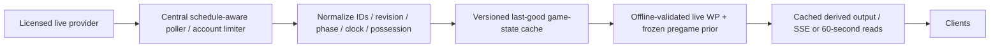

# MD-06 Live win-probability feasibility

Cycle 7, 2026-10-04; base `cf391daa2d43a44fe9d742ea0b96cc537d1a7136`. Investigation REVIEW; source, purchase, implementation, public scope and business model are NOT AUTHORIZED. [Reproduction](research/cycle7/README.md), [model output](research/cycle7/results/live_wp.json), [cost arithmetic](research/cycle7/results/costs.json), [synthesis](CYCLE7_MULTI_MD_SYNTHESIS.md).

## Source feasibility (checked 2026-10-04)

This is a documentation assessment, not a measured live-feed trial. No API account, trial, purchase or contact was initiated. “Documented” below does not mean independently measured reliability or legal clearance for all downstream rights.

| Source | Access, timing, replay | Price/rate | Commercial/cache/redistribution boundary | Current conclusion |
| --- | --- | --- | --- | --- |
| nflverse PBP | Public files; historical seasons; raw game PBP typically after final, cleaned on scheduled runs | Free; no live SLA | Dataset [CC BY 4.0](https://github.com/nflverse/nflverse-data/blob/main/LICENSE.md), attribution/change notice; not a universal license for all upstream datasets/logos | Adequate offline research, inadequate 60-second live state; [update schedule](https://nflreadr.nflverse.com/articles/nflverse_data_schedule.html) |
| BALLDONTLIE NFL | Authorization API key; documented plays and pagination; best-effort live timing; historical example, complete replay coverage unverified | NFL GOAT $39.99/month, 600 requests/min; free 5/min and ALL-STAR do not include plays; [NFL docs](https://nfl.balldontlie.io/) | [Terms §6](https://www.balldontlie.io/terms) permit commercial display/cache/derivatives/distribution without mandatory attribution; prohibit competing services and raw unmodified resale; third-party rights not cleared; no key distribution | Affordable conditional candidate; missing state/correction guarantees prevent calling it adequate yet |
| SportsDataIO commercial NFL | API key; live state/PBP; [replay](https://sportsdata.io/developers/replay) for integration; [timing](https://sportsdata.io/help/refresh-rates-feeds-and-timing) typically tens of seconds, not a guarantee | Commercial quote; request volume is not its pricing factor; request limits/product scope contract-specific | [Commercial licensing](https://sportsdata.io/help/data-rights-and-licensing-questions) supports licensed-product caching/storage; raw data resale requires separate rights; display/audience/attribution terms need actual agreement | Stronger field coverage; affordability unknown. Discovery Lab is delayed/personal-use, not an inexpensive commercial live substitute |
| Sportradar official NFL v7 | API key; [PBP](https://developer.sportradar.com/football/reference/nfl-play-by-play), game states; in-progress TTL 3 seconds; [simulations/replay](https://developer.sportradar.com/getting-started/docs/simulations) | [Custom quote](https://sportradar.com/media-tech/data-content/sports-data-api/); account QPS/quotas contract-specific; trial is not production permission | Commercial product exists; FORCE license, retention, redistribution and attribution provisions unverified; cache TTL is not a rights grant | Technically strong, cost/rights unresolved; no invented enterprise estimate |

Technically reachable ESPN/community endpoints are not promoted as a commercially licensed source. No adequate free live route was established in this bounded review; that is not proof none exists. The source policy remains free first if adequate, then relatively affordable licensed paid. A fixed published subscription is not authorization to buy it.

## Required field contract

| State requirement | nflverse historical PBP | BALLDONTLIE documented plays/games | SportsDataIO Score/PBP | Sportradar PBP |
| --- | --- | --- | --- | --- |
| Score | Pre/post play and final | `home_score`/`away_score`, game totals | `HomeScore`/`AwayScore` | team points, play home/away points |
| Quarter/clock | qtr, remaining seconds | `period`, `clock_display`, `wallclock` | `Quarter`, `TimeRemaining` | quarter/overtime, clock |
| Possession | posteam/defteam | `team`, end-possession text; exact next-state semantics **unverified** | `Possession` | start/end situation possession |
| Down/distance/field | down, ydstogo, yardline_100 | start/end down, distance, yards-to-endzone | Down, Distance, YardLine/Territory | down, yfd, location |
| Timeouts | remaining home/away | **Not documented in reviewed plays schema** | HomeTimeouts/AwayTimeouts | remaining_timeouts |
| OT and final | qtr, game type/results; no live finality guarantee | period, game OT scores, status_state; OT state completeness unverified | Quarter OT/F, Status, IsClosed | overtime number, game status |
| Correction/overturn | revised published archive, challenge fields; not arrival replay | stable play ID/wallclock; no documented revision cursor or correction-finality contract | replay/PBP; postgame corrections documented, exact ordering contract to verify | updated/deleted events; full reconciliation/finality mapping to verify |

SportsDataIO field evidence: [NFL dictionary](https://sportsdata.io/developers/data-dictionary/nfl). Sportradar field evidence: [PBP schema](https://developer.sportradar.com/football/reference/nfl-play-by-play). BALLDONTLIE schema is ascending wallclock, cursor-paginated, at most 100 rows/page. An incremental tail cannot guarantee discovery of edits to older plays; periodically/full polling plus game metadata is budgeted. Do not infer possession from the last play's actor, synthesize remaining timeouts from absent data, or use provider home_win_probability as FORCE input.

Historical PBP availability is different from timestamped live-arrival/correction replay. None of the providers' reviewed documentation proves that their replay reproduces every original publication delay and later revision. An acceptance trial must measure live latency, turnovers, score reversals, timeout resets, halftime and OT before feed adoption. NFLverse research does not substitute for that trial.

## Central polling cost envelope

One upstream state request per game per 60 seconds; planning window 240 polls/game including pregame, halftime/OT allowance and final reconciliation. These are assumptions, not measured provider latency. For paginated reconciliation, budget four play pages + one game-status request (5/poll). Scheduling metadata, retries and operations must be added. No per-viewer upstream requests.

| Scope | REG + playoff games | Single-state calls | 5-request calls | Mean/month over active months | BDL subscription cost |
| --- | ---: | ---: | ---: | ---: | ---: |
| A: one featured event | 1 + 0 | 240 | 1,200 | 1,200 (1 month) | $39.99 for one month |
| A: weekly featured season | 18 + 3 | 5,040 | 25,200 | 4,200 (6 months) | $239.94 |
| B: TNF/SNF/MNF + selected playoffs | 54 + 6 | 14,400 | 72,000 | 12,000 | $239.94 |
| C: every game, paid access | 272 + 13 | 68,400 | 342,000 | 57,000 | $239.94 |
| D: every game, public access | 272 + 13 | 68,400 | 342,000 | 57,000 | $239.94 |

B is an explicit 3 distinct games/week ×18 planning envelope plus six playoff selections, not an actual broadcast schedule count. Doubleheaders may overlap (budget two simultaneous B games). Owner-selected games/calendar define the exact pilot. Six paid months cover September through February; $39.99 is the checked monthly price, not a promised locked seasonal offer. Taxes, host/egress, vendor scope changes and account limits are additional. Free BDL cannot supply plays. NFLverse $0 is not a live alternative. SportsDataIO and Sportradar seasonal total = the accepted scope quote plus hosting; public evidence cannot populate that number. Do not use a personal tier or a made-up per-request price.

Sunday envelope: typical selected concurrency must come from the season schedule; use the conservative maximum of 16 simultaneous pairings for all-NFL sizing. At 5 requests/poll this is 80 requests/minute, independent of viewer count. Worst stress: 360 polls/game, ten pages+one metadata request, doubled for bounded retries = 2,257,200 seasonal requests and 352/minute at 16 games, below the documented 600/minute GOAT tier. Four pages are an unverified planning assumption; exceeding the ten-page cap must produce unavailable/stale status, not silently incomplete state. Jitter polling and enforce one account-wide limiter; burst/QPS behavior still needs a trial.

Paid versus public does not change these central upstream totals, but it changes licensing scope and fanout costs. Example downstream envelope: 1,000 viewers ×240 one-minute reads ×2 KiB = 240,000 reads /468.75 MiB per event. Actual hosting/storage/CDN/WebSocket cost needs selected infrastructure, payload size, concurrent viewers and existing quotas. It is not included in $239.94.

## Likely system architecture and failure policy (proposal)

Proposed state envelope: game/season/phase IDs, source/version, provider event/revision time when available, ingestion time, score/clock/possession/down/distance/field/timeouts, finality, validation quality, pregame model/input SHA and derived model version. Poll only relevant live/pre-live games; lease/single-flight per game and account-wide bounded fanout. Key stays server-side. Clients cannot force upstream polls, arbitrary game URLs or refresh storms. Apply request/body bounds, public cache, entitlement gate if selected, local rate limits and bounded retry/backoff. Review under SEC-01 in an authorized safe environment, not production probing.

| Condition | Proposed behavior |
| --- | --- |
| Age >120 seconds / outage | Last-good probability with explicit stale timestamp; after owner-selected hard cutoff (candidate 300s), unavailable. Poll failure must not refresh source-age |
| Possession or timeout unknown | Use a separately validated reduced-feature model or abstain; no precise full-state probability by guessing |
| Corrected play / overturned score | Reconcile by stable ID and full current state; new revision may legitimately reduce score; atomically invalidate/recompute derived WP |
| Inconsistent clock/quarter/down | Quarantine, retain last-good state and stale label; never advance game time from browser wallclock through stoppages |
| Halftime | Display phase; stop game-clock decay, retain validated second-half possession context; do not invent a live ball |
| OT | Separate rule-version/regular-season/postseason state machine and model; require possession opportunities, period/timeouts. Until validated, abstain |
| Final | Verified winner outcome; handle ties explicitly, distinguish provisional final from verified/closed, allow corrected final reconciliation |
| Cache TTL | Candidate 60s derived-response TTL, phase-aware upstream polling; age limits independent of provider cache TTL; no authorization of these defaults |

OT rule versions matter: [2026 official rulebook](https://operations.nfl.com/rules-officiating/2026-nfl-rulebook) retains a bounded regular-season extra period and distinct postseason handling; do not extrapolate a regulation logistic clock across overtime. The 2024 and 2025 REG OT rules also differ. The pilot's tie semantics (home win vs loss vs tie, or win-equivalent) and stale/unknown presentation remain owner choices.

## Offline model evidence and exact missing FORCE evidence

The repository already has [no-spread nflfastR model JSON](data/nflfastr_wp_model.json) and inference in [server](force_server.py), used for historical penalty/game-flow context, not a licensed live feed. That model's packaged training cutoff is not established here, so applying it to 2025 would not certify an untouched holdout. Its regulation clock clamping does not establish valid OT behavior.

`live_wp.py` instead fits fresh regularized logistic state models on 2024 (272 REG games; 16,422 sampled states), evaluates 2025 (271 decisive games; 16,225 states), and weights each game equally. Each state is the first eligible **pre-play game-clock-minute** observation, not a 60-second wallclock poll. Known state includes score, remaining time, possession, down/distance, field position and timeouts. No post-play score, provider WP, EPA, betting odds or future outcome enters predictors. Finals are labels; one tied 2025 game and OT states are excluded explicitly. This is a limited regulation/decisive-game population, not whole-NFL live validation.

A causal neutral-start Elo **proxy** supplies a strength feature: 1500 start in 2024, K20 result updates after each week, 30% offseason pull, home advantage50 and logit scale400. Week batching is conservative; future-final mutation cannot change prior kickoffs. This is **not canonical FORCE** and none of its constants is a proposed FORCE retune. Exact game-state-only versus **canonical FORCE prior** validation could not be completed: the package lacks matched causal historical unit/profile/retro/continuity inputs and archived pre-kickoff prior provenance. No final-season rating is substituted. Needed evidence: reconstruct/freeze the exact full-stack prior at every kickoff, held-out seasons including ties/playoffs/OT and rule versions, then compare with identical state samples and an arrival-time replay if claiming real live accuracy.

| Predeclared model | Overall Brier | Early (first quarter) | Middle | Late (last quarter) | 10-bin ECE |
| --- | ---: | ---: | ---: | ---: | ---: |
| State only | .174418 | .235030 | .176540 | .109004 | .024364 |
| State + constant proxy logit | .172157 | .220383 | .176188 | .115444 | .049368 |
| State + linearly decaying proxy | .171152 | .229513 | .173341 | .107875 | .050192 |
| State + three phase-specific proxy coefficients | .171873 | .224694 | .176046 | .110238 | .052843 |

Early includes remaining≥2700, late≤900, middle excludes both; all groups use game-normalized weights. The linear model's Brier delta −.003266 has game-cluster bootstrap 95% interval [−.017887,+.012027] (1,000 resamples, fixed seed). All prior intervals cross zero; ECE gets worse, and constant prior worsens late Brier. These exploratory variants are not holdout-selected production choices or proof that prior contribution passes policy.

State-only feature ablations: remove score→.246605, remove clock/score-clock interaction→.176051, remove field→.174955, remove down/distance→.174549. These are joint-model sensitivity, not causal importance or permission to omit small-effect fields. Prior decay should be trained/validated, not scheduled just because it looks natural. Mutation/negative controls include future-final prior isolation, neutral-prior identity and byte-identical reruns. No OT probability is produced by this prototype.

## Recommendation, alternatives and owner gates

Recommend **one featured-game feasibility pilot only after** a complete licensed field/correction/latency contract and an offline canonical-FORCE comparison. Begin with a modest provider validation, not public all-games shipping. BALLDONTLIE is the first affordable candidate to verify; its field gaps can disqualify it. SportsDataIO/Sportradar are quote alternatives if they satisfy rights and budget. A paid provider is considered because no adequate free live source was established, not because free investigation was skipped.

Business choices remain open: free featured pilot (bounded maintenance/feedback), primetime package (more evidence, same fixed-tier price), paid all-games (entitlement/product decision and wider concurrency), public all-games (same upstream but more downstream/operations exposure), or mixed free-featured/paid-all. No option is selected. Support: modest conditional subscription arithmetic and offline technical prototype. Counterevidence: missing feed guarantees and worsened proxy calibration. Uncertainty: actual license/product completeness, viewer cost, canonical FORCE increment and OT/ties. Falsifiers: measured feed failure at required cadence, incompatible display rights, unaffordable quote, or matched FORCE holdout with no robust calibrated improvement. Do not build a confident live FORCE product on the current proxy result.
